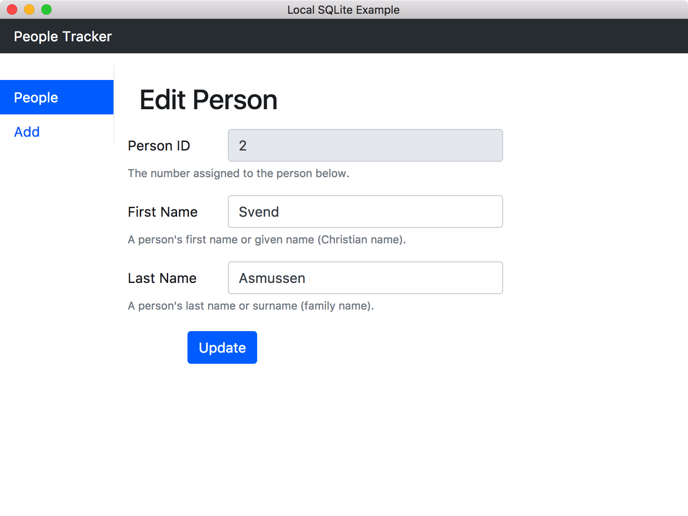
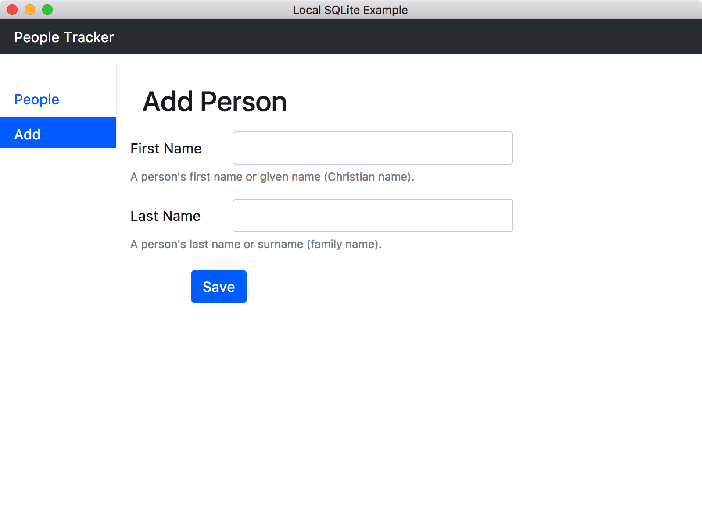

How to Build an Electron App with a Local SQLite3 Database That's Portable.
------------------------------------------------------------------------

This project demonstrates how to install and use a local SQLite3 database in Electron using SQL.js. SQL.js is a port of SQLite to JavaScript, by compiling the SQLite C code with [Emscripten](https://github.com/kripken/emscripten). Using only JavaScript means there are no C bindings or node-gyp compilations to deal with.

Quick Code Tour
---------------

 - The code entry point is in **package.json** under the key "main". The value is "main.js"
 - **main.js** calls model.initDb() from **model.js** which creates a new SQLite3 database from **schema.sql**. A callback creates a BrowserWindow and loads **index.html**.
 - **index.html** loads Bootstrap's CSS in the &lt;head&gt; tag and **renderer.js** after the closing &lt;body&gt; tag.
 - **renderer.js** loads Cheerio, jQuery, Bootstrap and it's dependency; Tether.
 - The application's database work is all done in **model.js**. Here you'll find functions to open and close the database as well as functions to select, insert, update, and delete records. [Prepared statements](https://en.wikipedia.org/wiki/Prepared_statement) are used throughout.
 - The application opens with a list of people. Click a red X to delete a person's record.

 
 - Click a pencil (shown above) to edit a person:

 
 - Click Add in the left rail to add a new person record:

 

Uninstalling
-------------

 Please note that running this application will install a tiny SQLite database in the folder returned by electron.app.getPath('userData'). To uninstall simply delete this folder.
